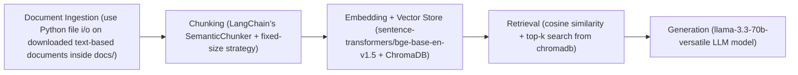

# Project 1 Planning: The Unofficial Guide

> Write this document before you write any pipeline code.
> Your spec and architecture diagram are what you'll use to direct AI tools (Claude, Copilot, etc.) to generate your implementation — the more specific they are, the more useful the generated code will be.
> Update the Retrieval Approach and Chunking Strategy sections if you change your approach during implementation.
> Update this file before starting any stretch features.

---

## Domain

<!-- What domain did you choose? Why is this knowledge valuable and hard to find through official channels? -->
I have chosen the domain "Housing and Dorms at UC Irvine" because I used to have questions like:
- "Which dorms are quiet versus social, and which suit freshmen vs upperclassmen?"
- "What hidden costs should I expect besides housing rates?"
- "Is the UCI housing lottery actually random, or are there patterns students report?"
- "how is the safety level at dorm X?"
- "how is the living cost for off‑campus complexes near UCI compared to on‑campus dorm options?"

This knowledge is valuable because it usually comes from students' practical experience about on‑campus and nearby housing, including lottery behavior, waitlist tactics, roommate fit, maintenance responsiveness, hidden costs, and move‑in logistics, etc. The official pages list rules and rates but rarely capture timing tricks, social dynamics, or real-world issues that students depend on.

---

## Documents

<!-- List your specific sources: URLs, subreddit names, forum threads, or file descriptions.
     Aim for at least 10 sources that together cover different subtopics or perspectives within your domain. -->

| # | Source | Description | URL or location |
|---|--------|-------------|-----------------|
| 1 |Reddit|students sharing and comparing their experiences and opinions on housing at UCI, including costs, availability, and the challenges of finding affordable on-campus or nearby housing.|https://www.reddit.com/r/UCI/comments/1b40x2f/housing/|
| 2 |ratemydorm|a student review-based ranking of UC Irvine dorms that compares housing options using crowd-sourced ratings and written experiences about comfort, location, cost, and overall living quality.|https://www.ratemydorm.com/dorms-ranked/university-of-california-irvine|
| 3 |wordpress blog|a detailed student-written review of UC Irvine undergraduate housing that compares and ranks the on-campus dorms and apartment communities based on livability, amenities, social life, and overall student experience.|https://campusobscura.wordpress.com/2024/06/11/the-best-and-worst-of-ucis-undergrad-on-campus-housing/|
| 4 |Reddit|student asking for advice about freshman dorm options and get advice|https://www.reddit.com/r/UCI/comments/1ruj1dt/dorms/|
| 5 |Reddit|a first-year student’s breakdown of UC Irvine dorm life, comparing Mesa Court and Middle Earth, sharing pros and cons like location, bathroom quality, social life, and overall living experience.|https://www.reddit.com/r/UCI/comments/1jckpkn/first_year_housing_scoop/|
| 6 |society19 blog|article about a student's ranking of UC Irvine dorms that compares the different housing communities and explains their pros and cons based on location, amenities, room quality, and overall freshman experience.|https://www.society19.com/ultimate-ranking-uci-dorms/|
| 7 |prked blog|an insider guide to UC Irvine undergraduate housing that explains the different dorm communities and compares their layouts, social atmosphere, amenities, and tradeoffs to help incoming students choose where to live.|https://prked.com/post/deciphering-the-dorms-an-insiders-guide-to-the-best-housing-at-uc-irvine|
| 8 |tripalink blog|a comparison of UC Irvine dorms versus off-campus housing|https://tripalink.com/blog/uc-irvine:-dorms-vs.-off-campus-housing|
| 9 |Reddit|dorm recommendations and application tips for incoming UCI freshmen|https://www.reddit.com/r/UCI/comments/1t00phj/dorm_recommendations_and_application_tips_for/|
| 10 |Reddit|advice on how to find housing near UCI|https://www.reddit.com/r/UCI/comments/1luxaac/where_to_look_for_housing/|
| 11 |Reddit|advice on housing options for continuing students|https://www.reddit.com/r/UCI/comments/1oa9vmh/housing_recs_for_second_yr/|

---

## Chunking Strategy

<!-- How will you split documents into chunks?
     State your chunk size (in tokens or characters), overlap size, and explain why those
     numbers fit the structure of your documents.
     A review-heavy corpus warrants different chunking than a long FAQ. 
     
     Guiding questions — use these to think it through before deciding:
     - Are your documents short reviews (1–3 sentences) or long guides (many paragraphs)? How does that affect the right chunk size?
     - If a key fact spans two adjacent chunks, will either chunk be retrievable on its own? What does overlap help with?
     - How would you know if your chunks are too small? Too large? What would bad retrieval results look like in each case?

     Useful AI prompts:
     - "Explain how chunk size affects retrieval quality for short, opinion-based reviews."
     - "What are the tradeoffs between chunking by paragraph vs. fixed character count for [my document type]?"
     - "If I use 200-character chunks for review text, what kinds of queries might this fail for?"]

-->

**Chunk size:** Semantic chunks for long guide sections + 50-characters fixed-size chunks for short comment/review Reddit

**Overlap:** 10 words when fixed-size splitting is needed

**Reasoning:**
After skimming the selected docs I noticed two patterns: Reddit threads contain many short comments (1–3 sentences), while the review/blog corpus has longer, multi-paragraph guides. Because of that mix, I should not force every document into the same fixed size. Instead, I will keep short comments and short reviews intact when possible, and use LangChain’s `SemanticChunker` for longer guide-style pages so the chunks follow topic boundaries.

For short, opinion-based reviews, chunking should preserve the full fact. If I split them too short, I may separate one fact into many chunks and lose its overall meaning, and if I make them too large, I may mix multiple topics together. For long guides, semantic chunking should keep related details together, and a small overlap helps preserve facts that cross chunk boundaries.
---

## Retrieval Approach

<!-- Which embedding model are you using (e.g., all-MiniLM-L6-v2 via sentence-transformers)?
     How many chunks will you retrieve per query (top-k)?
     If you were deploying this for real users and cost wasn't a constraint, what tradeoffs
     would you weigh in choosing a different embedding model — context length, multilingual
     support, accuracy on domain-specific text, latency? 
     
     Guiding questions:
     - How many retrieved chunks is enough to give the LLM useful context? What happens if you retrieve too few? Too many?
     - Why does semantic search find relevant chunks even when the query doesn't share exact words with the document?

     Useful AI prompts:
     - "What are different strategies for structuring embeddings for short, opinion-based text?"
     - "What does top-k mean in a retrieval system, and what are the tradeoffs of setting it too high vs. too low?"]
-->

**Embedding model:** bge-base-en-v1.5 via sentence-transformers

**Top-k:** 10

**Production tradeoff reflection:** a simpler embedding model would be more memory-efficient and likely sufficient for a small project. However, I’m choosing the stronger model bge-base-en-v1.5 because it should improve semantic matching for subjective, opinion-heavy text. For retrieval step, I would have 2 retrieval functions, one for plain ChromaDB sematic search, and one for semantic + BM25 keyword search, so i can observe the tradeoff between pipeline complexity and effectiveness. Choosing k also comes with a tradeoff because higher k (more chunks) can give richer context, but may add noise to the context and make the final answer less focused.

---

## Evaluation Plan

<!-- List your 5 test questions with their expected correct answers.
     Questions should be specific enough that you can judge whether the system's response
     is right or wrong. "What are good dining halls?" is too vague.
     "What do students say about wait times at [dining hall name] during lunch?" is testable. -->

| # | Question | Expected answer |
|---|----------|-----------------|
| 1 |Which dorms are quieter or more social, and which suit freshmen vs upperclassmen?|Mesa Court is often more social and Middle Earth is more quiet, and freshmen are required to stay in either of these. For continuing/transfer students, the Arroyo Vista apartments are one of the housing choices for them.|
| 2 |What hidden costs should I expect besides housing rates?|Common extra costs include meal plans for on-campus dorms, separate parking fees for ACC/off-campus housing, and utilities in some apartments.|
| 3 |Is the UCI housing lottery actually random, or are there patterns students report?|The process is competitive and lottery-like.|
| 4 |how is the safety level at Middle Earth?|Middle Earth is generally safe, but students mention some practical issues in the classics like older facilities, pests, and maintenance problems|
| 5 |how is the living cost for off‑campus complexes near UCI compared to on‑campus dorm options?|On-campus dorms can be expensive especially when meal plan are required. Off-campus can be more flexible, but not always cheaper.|

---

## Anticipated Challenges

<!-- What could go wrong? Name at least two specific risks with reasoning.
     Consider: noisy or inconsistent documents, missing source attribution, off-topic
     retrieval, chunks that split key information across boundaries. -->

1. Noisy or inconsistent documents: the corpus mixes student reviews, blog posts, and Reddit comments, so the same dorm can be described very differently across sources. That can confuse retrieval and produce contradictory answers.

2. Chunks split key context: if a review gets cut in the middle of an opinion or example, the retriever may miss the full meaning. This is risky for short comments where one sentence contains the main judgment.

3. Off-topic retrieval: some posts include broad housing advice or unrelated discussion, so the system may retrieve general housing content instead of the exact dorm-specific answer the user asked for.

---

## Architecture

<!-- Draw a diagram (hand-drawn sketch, an ASCII diagram, Mermaid diagram, etc.) of your pipeline showing the five stages:
     Document Ingestion → Chunking → Embedding + Vector Store → Retrieval → Generation
     Label each stage with the tool or library you're using.
     You can use ASCII art, a Mermaid diagram, or embed a sketch as an image.
     You'll use this diagram as context when prompting AI tools to implement each stage. -->

---

## AI Tool Plan

<!-- For each part of the pipeline below, describe:
     - Which AI tool you plan to use (Claude, Copilot, ChatGPT, etc.)
     - What you'll give it as input (which sections of this planning.md, which requirements)
     - What you expect it to produce
     - How you'll verify the output matches your spec

     "I'll use AI to help me code" is not a plan.
     "I'll give Claude my Chunking Strategy section and ask it to implement chunk_text()
     with my specified chunk size and overlap" is a plan. -->

**Milestone 3 — Ingestion and chunking:** I'll give github copilot my documents and the chunking strategy, chunk size, and overlap size stated in planning.md. I'll ask it to analyze the doc and define important metadata I should include with each chunk. Then, the AI will help me implement ingest_documents() and chunk_document(doc).

Before ingesting the docs, I'll ask claude to generate preprocess_pdf() where pdf files saved in the documents/ folder are extracted, clean, and pre-processed (remove navigation text, ads, etc.) to reduce noise.

ingest_documents() should load the cleaned documents from the preprocess_pdf(), augmented the text with appropriate metadata (timestamp, site name, url) and produce structured dictionary with text ready for chunking.

chunk_document() should split the documents into chunks using semantic chunking for long-review docs, and sentence chunking for docs with short comments.

**Milestone 4 — Embedding and retrieval:**
I'll ask claude to explain how i can use chromadb's embedding functions and query functions based on semantic similarity search. Then i'll ask it to implement embed_and_store() and retrieve(query)

For the retrieval part, I'd also ask AI to implement a retrieve_v2(query) function where I combine semantic search with keyword (BM25) search, so that i can examine the affectiveness of each the hybrid retrieval method

**Milestone 5 — Generation and interface:**
For generate, I'd build a prompt and use claude to strengthen my prompt to make sure my LLM model generates answers using only the retrieved chunks as context and include source attribution.

For the interface, I'd use claude to plan out the interface design, pick out some library i can use to generate UI in python project, and finally ask it to generate the UI for me.
